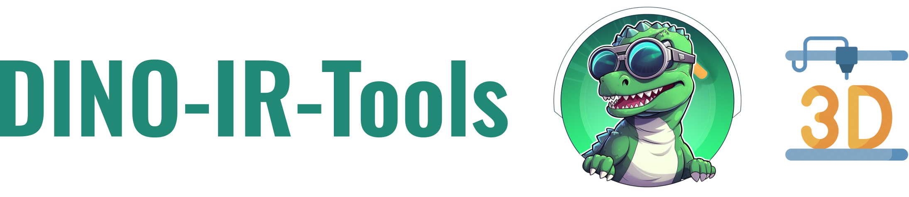
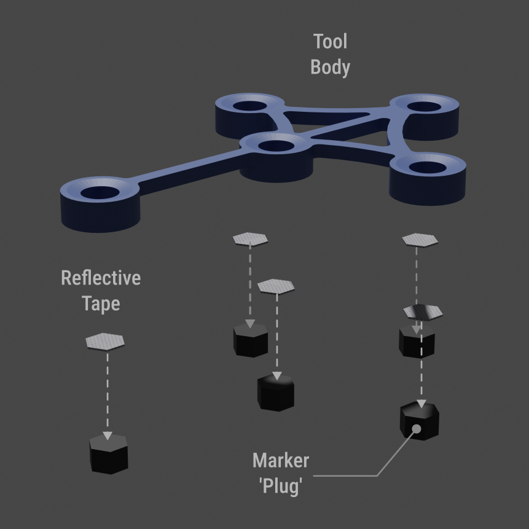
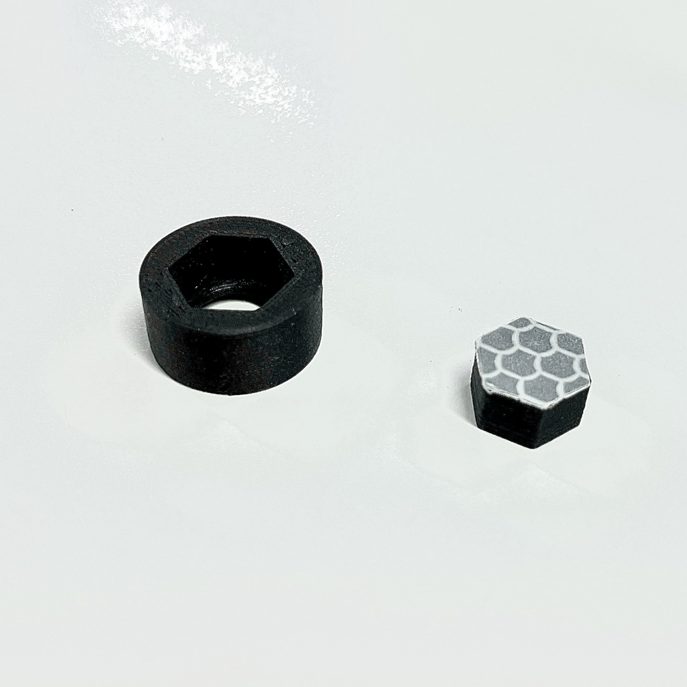
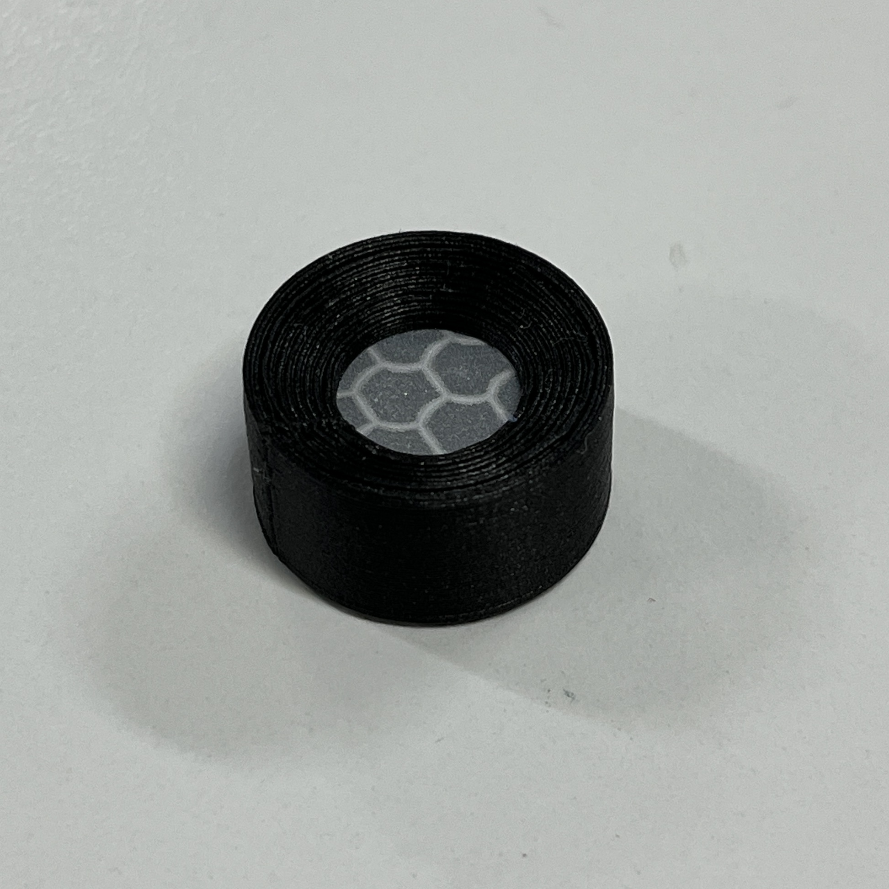
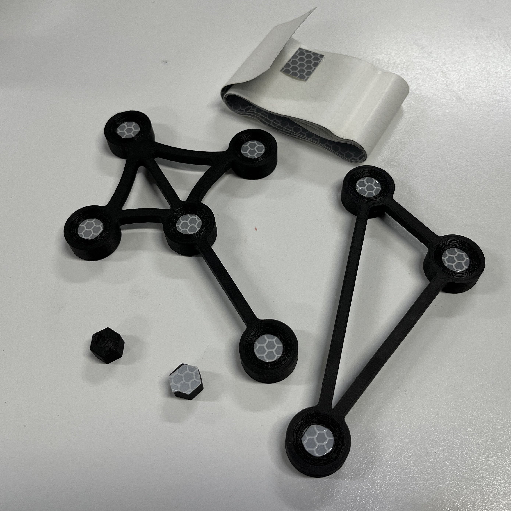

  

<html>
<body>
   <h3 align="center"><strong>HoloLens 2 &amp; <ins>D</ins>etection for <ins>I</ins>nfrared <ins>N</ins>avigation with <ins>O</ins>ST AR headsets</strong>

   

    <a href="#overview">Overview</a> •
    <a href="#3d-model-info">3D Model Info</a> •
    <a href="#additional-notes">Additional Notes</a> •
    <a href="#acknowledgements">Acknowledgements</a>  
  

</body>
</html>

## Overview
In some of our research, we have worked with surgical tools which are outfitted with retroreflective markers and tracked by standing external infrared stereo cameras / trackers. We've also attempted to make our own easily 3D-printable tools which can be tracked by similar devices. This repository contains some files which were 3D printed and used to create IR-reflective tools, which could be tracked by the Microsoft HoloLens 2 headset.

You can 3D print the two sample tools: a '[stylus](models/stylus/StylusToolBody.STL)' tool, a '[triangle](models/triangle/TriangleFrame.STL)' tool, and 8 [plugs](models/InnerMarkerPlug11_5MM.STL) and assemble as illustrated in the image below to get started with `DINO-Unity`. 

If there are situations where you want to create your own tools to be tracked by such sensors, then hopefully the files in this repository are useful for you. Check out the instructions below for how you could  fabricate your own tools which can be detected by other infrared trackers.

<html>

  
  

  <em>Left: An exploded view of a tool with flat IR-reflective markers. Right: A tool being assembled</em>

</html>

## 3D Model Info

### Create Individual Retroreflective Marker Assemblies 

To imitate the response of retroreflective spheres and other markers, we have used various retroreflective adhesive tapes. There are many you can find online, but in our work this is the one we've used most:

`ifm electronic Reflective Tape for Use with Redlight & Infrared Light Sensors. Manufacturer part no: E20401`

To create a single flat marker assembly, you have two parts: 
1. A hexagonal 'plug', on top of which you attach your retroreflective tape, and then trim around the edges with scissors
2. An outer shell, which has a hexagonal hole on the bottom (with ~+0.5mm clearance) to slide the plug into, and a circular cutout on the top, which hides the straight edges of the hexagon.

<html>

  
  

  <em>Left: Marker plug and outer shell before assembly. Right: A full flat marker assembly</em>

</html>

### Designing and Assembling A Tool
When designing a tool, we've taken a single flat-marker assembly, and then designed a frame or body to connect several markers together rigidly. You can then 3D print the plugs, the body, and assemble everything together to create a tool. The images below show some tools we fabricated using the Markforged Onyx Mark Two.

<html>

  

  <em>Two assembled tools, and a couple of extra hexagonal 'plugs', one of which has the reflective tape attached to it</em>

</html>

### File List in Repository
|Files               | Notes    |
|------------------- |----------------------------------------------------------------------------------------------------------------------------|
|InnerMarkerPlug11_5mm (`.sldprt`, `.stl`, `.STEP`)|The 'plug' on top of which you attach the IR reflective tape                                  |
|OuterMarkerShell (`.sldprt`, `.stl`, `.STEP`) | Used to 'cover' the plug/tape, and gives the appearance of a circularly cut marker                |
|StylusToolBody (`.obj`, `.ply`, `.stl`, `.STEP`)  | The frame or body of the stylus tool tracked by the HoloLens 2 in the `DINO-Unity` sample app. |
|TriangleFrame (`.obj`, `.ply`, `.stl`, `.STEP`)   | The frame or body of the triangular tool tracked by the HoloLens 2 in the `DINO-Unity` sample app. |

`.sldprt` and `.STEP` files could be 'remixed' and used for designing your own tools with CAD software.

`.stl` files were used for 3D printing

`.ply` files were exported from SolidWorks and imported into Blender to create `.obj` files, which were then imported into Unity for use with the
`DINO-Unity` sample project.

# Additional Notes
The models designed in this repo were created with the intention of being a quick and easy test-bed for working with IR trackers. The tolerances and manufacturing processes being followed clearly cannot offer a sub-millimetre level of accuracy, at which point you'll start requiring commercial medical grade markers. The models are only intended to be used for making tools which could be used for feasibility tests in the environment of a research lab. 

The models supplied in this repository were made during a couple of afternoons of CAD work, and were created for purely non-commercial, research applications, with no intention or desire to commercialise. In that spirit, they have been shared under the terms of the [CC BY-NC-SA 4.0](https://creativecommons.org/licenses/by-nc-sa/4.0/) License. 

The material in this repo is intended to support non-commercial research applications. Within the commercial space, there are existing patents which relate to designs and use of low-cost flat retroreflective markers. 

# Acknowledgements
Thanks to:
* Joe Ball of Two Sugar Studio: for creating great renders for this README! 
* <a href="https://www.flaticon.com/free-icons/3d-printer" title="3d printer icons">3D Printer icon in repo logo created by Freepik - Flaticon</a>

